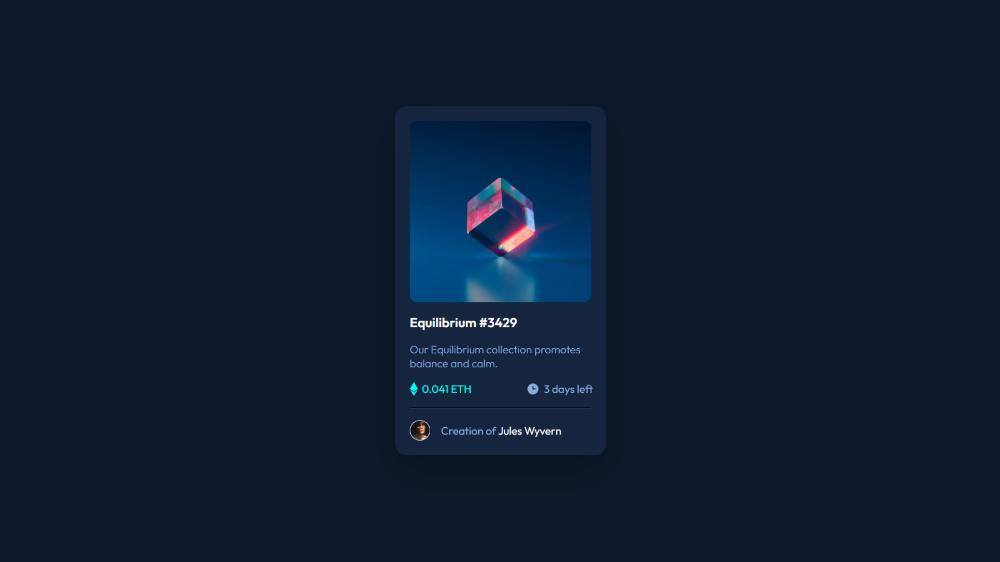

## Overview
In this project, I built an NFT preview card component and worked on matching the active hover states from the design. I focused especially on creating the image hover overlay with a centered eye icon.

### Key learnings
- Learned how to use `position: relative` on a parent element so absolutely positioned children can be placed inside it.
- Learned how `::before` can create a pseudo-element for a hover overlay.
- Learned that `content`, `position`, `inset`, and `background-color` are important for making a pseudo-element visible.
- Practiced using `opacity` with `:hover` to show and hide elements smoothly.
- Understood how selectors like `.parent:hover .child` target a child element when the parent is hovered.

## Project
- Live Site URL: https://daxitaseervi.github.io/nft-preview-card/

## Links
- Twitter/X: [https://x.com/kazzyyy__](https://x.com/kazzyyy__)
- Codepen: [https://codepen.io/Daxita-Seervi](https://codepen.io/Daxita-Seervi)
- Frontend Mentor: [https://www.frontendmentor.io/profile/daxitaseervi](https://www.frontendmentor.io/profile/daxitaseervi)
